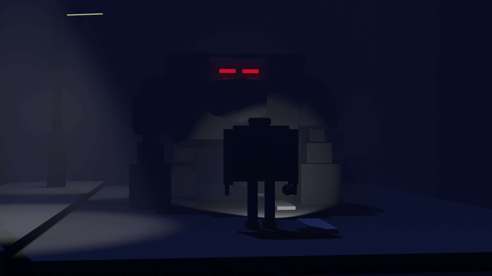
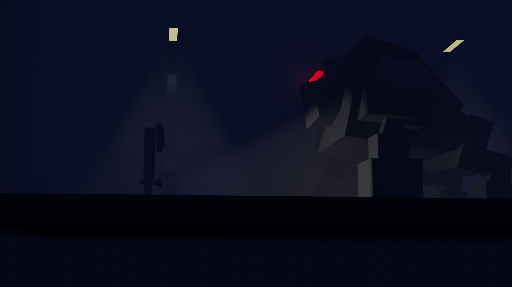
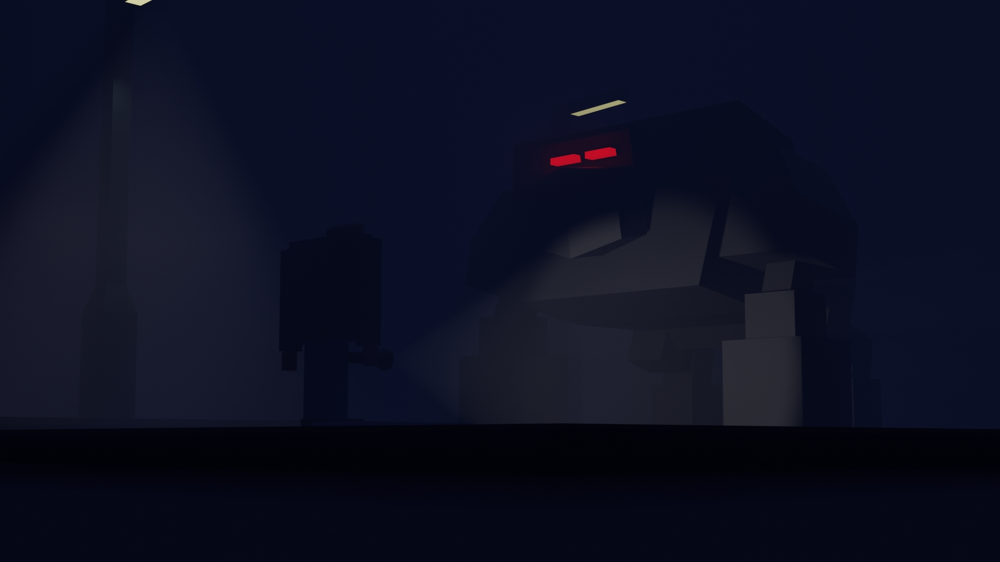

# HorrorEnviroment-Blender
 This is a simple 3d art using blender. (2020)

Here, I try to create a horror environment (A man on the street at midnight in front of a monster) in 3d using blender. This is a simple project for blender 3d test.

## Project description
Name: Horror-Environment-Blender  
Software: Blender  
Platfrom: 3D
Project No: update me 
Year: 2020
 
 
## Demo Video

## Screen shot

## 3D file
* **[Monster and man](https://github.com/XAbirHasan/HorrorEnviroment-Blender/blob/master/3D%20file/Monster%20and%20man.fbx)**

## Authors

* **AbirHasan**

Check out my other works [@XAbirHasan](https://github.com/XAbirHasan)
